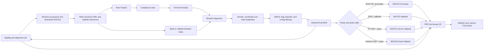

# short-read-processing: implementation plan

## Current implementation status

The accession sample-sheet validator, concurrent downloader, resolved-config
generator, one-command launcher, reference-preparation rules, and Snakemake
processing DAG are implemented.
The DAG covers raw/trimmed read QC, trimming, alignment, duplicate marking,
filtering, MACS3 `callpeak`/HMMRATAC, treatment/control bedGraphs, CPM BigWigs,
fragment-level FRiP, ATAC TSS/fragment QC, ChIP fingerprint/cross-correlation,
stable metrics, and MultiQC. All valid assay/caller/layout branches have
synthetic dry-run tests. Generated dm6/hg38 configs prepare checksum-pinned
FASTA, annotation, blacklist, TSS, autosome, chromosome-size, and Bowtie2 index
assets inside the DAG. Full real-data execution is still pending.

## Scope and decisions

Version 1 will process bulk ATAC-seq, TF ChIP-seq, and histone ChIP-seq from a
CSV/TSV sheet of public SRR/SRX/ERR/ERX accessions. It will resolve and cache
single-end or paired-end FASTQs internally, support user-supplied `dm6` and
`hg38` reference assets, per-library peak calling, signal tracks, and a single
QC report. Downloaded raw inputs will remain read-only.

Use Snakemake rather than Nextflow. Both are suitable, but Snakemake is the
smaller fit for a local Mamba prefix, a single tabular entry point, Python-based
validation, and selective reruns when one parameter set changes. Rule resources
and workflow profiles leave a clean path to SLURM or another executor later.

The first implementation will not infer biological controls, choose thresholds
automatically, or silently tune failed samples. Reference downloads use an
explicit checksum-pinned catalog recorded in resolved configs. Scientific
choices remain explicit and traceable.

## Workflow graph



Independent lanes and samples are separate jobs. Each aligner, sorter, peak
caller, and QC rule also declares its own threads, memory, runtime, and scratch
requirements so Snakemake can schedule jobs without oversubscribing the host.

## Software

| Stage | Primary software | Rationale |
|---|---|---|
| Orchestration | Snakemake 9 | Lightweight repo-local `.venv`; local/HPC execution, explicit DAG, config/schema validation, per-rule resources and benchmarks |
| Acquisition | ENA Portal API + aria2 + SRA Toolkit | Concurrent accession expansion, compressed FASTQ transfer with checksums/resume, and SRA fallback |
| Raw and trimmed read QC | FastQC + MultiQC | Requested before/after reports and cross-sample aggregation |
| Adapter/quality trimming | Cutadapt 5 | Deterministic paired-read handling, JSON report, named FASTA adapters, tunable error/overlap/quality parameters |
| Alignment | Bowtie2 2.5 | Mature short-read aligner used broadly for ATAC/ChIP; supports SE/PE and multithreading |
| BAM processing | SAMtools 1.23 + BEDTools | Streaming conversion, sort/fixmate/markdup, indexing, statistics, and blacklist exclusion |
| Peak calling | MACS3 3.0 | `callpeak` for ATAC/TF/histone branches and integrated `hmmratac` for paired-end ATAC |
| Coverage and fingerprint QC | deepTools | BigWig generation, coverage/fingerprint plots, and input-relative quality metrics |
| ATAC-specific QC | ataqv | TSS enrichment, fragment-length structure, mitochondrial fraction, peak coverage/FRiP-like metrics |
| ChIP-specific enrichment QC | phantompeakqualtools + deepTools | NSC/RSC cross-correlation and fingerprint/Jensen-Shannon metrics against input |
| Validation/tests | Typed table schema, Pytest, Snakemake lint/dry-run | Early rejection of invalid combinations and small regression tests |

`phantompeakqualtools` is retained because NSC/RSC are still standard ChIP QC,
but the values are less diagnostic for broad histone marks and must be reported
with that caveat. For ATAC, TSS enrichment, FRiP, fragment periodicity, usable
alignment fraction, and mitochondrial fraction are more meaningful than one
generic SNR number.

The orchestration environment contains Snakemake and development dependencies
only. Bioinformatics tools use the YAML files in `workflow/envs/`; Snakemake
creates their hashed environments under the repo-local `.snakemake/conda`
prefix configured in `profiles/local/config.yaml`. R and Bioconductor are
confined to `workflow/envs/chip_qc.yaml`, which includes `jq` because its
Bioconductor data-package post-link scripts require it.

The full BBMap adapter file is preserved in `resources/adapters.fa`. During
implementation, create reviewed TruSeq and Nextera subsets from it and select
the preset by library type. A config override may point to a custom FASTA.

## Accession sample-sheet entry point

The only user data input is a CSV or TSV following
`schemas/sample-sheet.schema.yaml`. One row represents one public run or
experiment accession. Repeated `sample_id` values are technical runs of the
same biological library and are merged only after lane-level QC/trimming.

```text
accession  sample_id  assay  genome  role       control_id  replicate  peak_caller
SRR100001  atac_rep1  atac   dm6     treatment              1
SRR100002  TF_rep1    chip_tf hg38   treatment   input_rep1  1          callpeak
SRR100003  input_rep1 chip_tf hg38   control                 1
```

Optional typed columns expose bounded overrides for HMMRATAC, MACS3, trimming,
alignment, and filtering. For example, ATAC `callpeak` with insertion-site
settings uses `macs3_format=BAM`, `macs3_nomodel=true`, `macs3_shift=-75`, and
`macs3_extsize=150`. No free-form shell argument column is accepted.

The acquisition stage writes an immutable FASTQ manifest and metadata snapshot.
The config stage combines them with the sample sheet into a fully resolved YAML
stored with run provenance; users do not supply FASTQ paths in the sheet.

For ChIP, control libraries use `role=control`; each treatment names the matched
control's `sample_id` in `control_id`. This makes relationships explicit and
allows a shared input where biologically justified.

The sample-sheet schema and semantic validator must reject at least:

- invalid/duplicate accessions, inconsistent technical-run rows, unreadable
  resolved FASTQ/reference paths, or unequal paired lane counts;
- `hmmratac` with anything other than paired-end ATAC-seq;
- a ChIP treatment without a valid matched input/control;
- unsupported assay/caller/layout combinations;
- missing TSS, blacklist, chromosome-size, mitochondrial, or effective-genome
  metadata required by selected rules;
- raw shell fragments in `extra`; expose only named, typed parameters.

## Processing details

1. Validate the sample sheet, resolve accessions concurrently, download or reuse
   checksum-verified FASTQs, and write the immutable manifest. Then validate
   reference consistency, FASTA/chromosome naming, FASTQ gzip integrity, sorted
   BED inputs, and Bowtie2 index presence.
2. Run FastQC on every raw lane, Cutadapt on every lane, and FastQC again. Use
   paired mode so mate synchronization is preserved. Keep Cutadapt JSON/logs.
3. Align all lanes for one library with a read group using Bowtie2. Start with
   `--very-sensitive`; use `--no-mixed --no-discordant` for PE data and an
   assay-configured maximum insert size. Stream into SAMtools rather than store
   SAM files.
4. Run name sort, `samtools fixmate -m`, coordinate sort, and `samtools markdup`.
   Keep a marked, unfiltered BAM for duplicate/mitochondrial QC and a final BAM
   filtered by layout-appropriate flags, MAPQ, blacklist, excluded contigs, and
   duplicate policy. Record counts at every boundary.
5. Call peaks from the final BAM. Use MACS3 `BAMPE` for paired-end ATAC/ChIP;
   use the documented SE model/shift settings only for SE. TF ChIP defaults to
   narrow peaks; histone ChIP defaults to broad peaks but permits an explicit
   narrow override (important for marks with mixed behavior such as H3K27ac).
   `hmmratac` is an ATAC PE-only branch and retains its model and cutoff-analysis
   report so its lower/upper/prescan cutoffs can be reviewed. Every q-value
   `callpeak` invocation includes `-B --SPMR` and declares both
   `<sample>_treat_pileup.bdg` and `<sample>_control_lambda.bdg` as outputs.
6. Produce CPM and, when the verified effective genome size is supplied, RPGC
   BigWigs. Keep unshifted fragment BAMs for PE peak calling; generate a separate
   Tn5-shifted ATAC signal representation where appropriate instead of changing
   the canonical BAM.
7. Calculate QC with a documented denominator. FRiP is usable fragments in
   peaks divided by all usable fragments for PE, and usable reads for SE. Avoid
   counting both mates as two independent fragments. Emit the numerator,
   denominator, and ratio.
8. Aggregate FastQC, Cutadapt, Bowtie2, SAMtools, MACS3, and custom metrics in
   MultiQC. Also emit a stable `qc/metrics.tsv` and `qc/metrics.json` for scripts
   and future agents.

## QC outputs

Every library should expose raw/trimmed read totals, adapter and quality-trimmed
fractions, mapping/proper-pair rate, MAPQ distribution, duplicate fraction,
mitochondrial fraction, final usable fraction, insert/fragment-size histogram,
peak count/territory, and FRiP numerator/denominator/value.

ATAC adds TSS enrichment/profile, nucleosome-free/mono/di-nucleosome fragment
patterns, and Tn5-shifted coverage. ChIP adds NSC/RSC and a deepTools fingerprint
comparison to the matched input; TF and histone results are labeled separately
because a broad mark should not be judged like a punctate TF.

QC thresholds initially annotate `pass`, `warn`, or `fail` without aborting the
run. Defaults must be documented as guidance, not universal biological truth.

## Parallelism and resources

- Raw QC and trimming run per lane; libraries run independently.
- Bowtie2, Cutadapt, FastQC, SAMtools sort/compression, deepTools, ataqv, and
  MultiQC receive rule-level thread counts where supported.
- Global `--cores` and `mem_mb` resources prevent the product of concurrent jobs
  and internal threads from exceeding the machine.
- Large alignment/peak intermediates are marked `temp()` only after downstream
  outputs are verified; raw FASTQs and canonical BAMs are never overwritten.
- `benchmark:` files capture wall time, CPU, and memory for later tuning.
- Use `profiles/local/config.yaml`, including its repo-relative
  `.snakemake/conda` environment prefix, and add a SLURM executor profile only
  when a target cluster is known; do not bake machine-specific paths into the
  workflow.

## Agent-ready tuning without autonomous behavior in v1

All scientifically meaningful values live under named `parameters` sections,
are typed by the schema, and are included in each rule's `params`. A tuning
attempt gets a new `run_id` and output namespace, preserving the baseline and
all earlier attempts. Each run records the original and resolved YAML, software
versions, input checksums, commands/logs, benchmarks, and a parameter hash.

The future agent should consume only stable JSON/TSV metrics and a bounded,
version-controlled tuning space. It may propose a new override YAML for approved
parameters such as Cutadapt overlap/error/quality, Bowtie2 sensitivity/insert
size, MAPQ, duplicate policy, or HMMRATAC cutoffs. It should never inject shell
text or mutate a running workflow. Add maximum attempts, parameter bounds,
minimum-improvement rules, dry-runs, and a human approval point before promoting
an attempt. This avoids silent result replacement and makes optimization
auditable.

## Implementation phases and verification

1. **Foundation:** repository layout, local profile, sample-sheet schema, semantic
   checks, adapter subsets, and reference manifest. Verify environment commands,
   config-positive/config-negative tests, `snakemake --lint`, and a dry-run.
2. **Shared preprocessing:** raw/trimmed FastQC, Cutadapt, Bowtie2, SAMtools
   mark/filter/index, and count audit table. Test tiny synthetic SE and PE data;
   run `samtools quickcheck`; assert paired-read and filtering invariants.
3. **Peak branches:** implement ATAC `callpeak`, ATAC PE `hmmratac`, TF narrow,
   and histone broad branches. Test that invalid combinations fail before jobs
   start and that peak outputs are nonempty, sorted, and format-valid on fixtures.
4. **QC/reporting:** implement exact fragment-level FRiP, ataqv, deepTools,
   phantompeakqualtools, BigWigs, metrics JSON/TSV, and MultiQC. Reconcile each
   metric with independently counted toy data.
5. **Reproducibility/performance:** provenance, benchmarks, local resource
   profile, rerun tests after parameter changes, and a documented small
   end-to-end example for both genomes. Generate a platform lock/explicit package
   list after the workflow tests pass.
6. **Later, replicate analysis:** add pooled/consensus peaks and IDR for suitable
   narrow-peak assays, plus broad-mark overlap/reproducibility. Keep this outside
   v1 unless replicate-level inference is explicitly requested.

Acceptance for v1 is an end-to-end synthetic test for all valid assay/layout/
caller branches, a small real-data smoke test for `dm6` and `hg38`, consistent
audited counts from FASTQ through final BAM, and a complete MultiQC plus
machine-readable metrics report. Real-data downloads require explicit approval.
