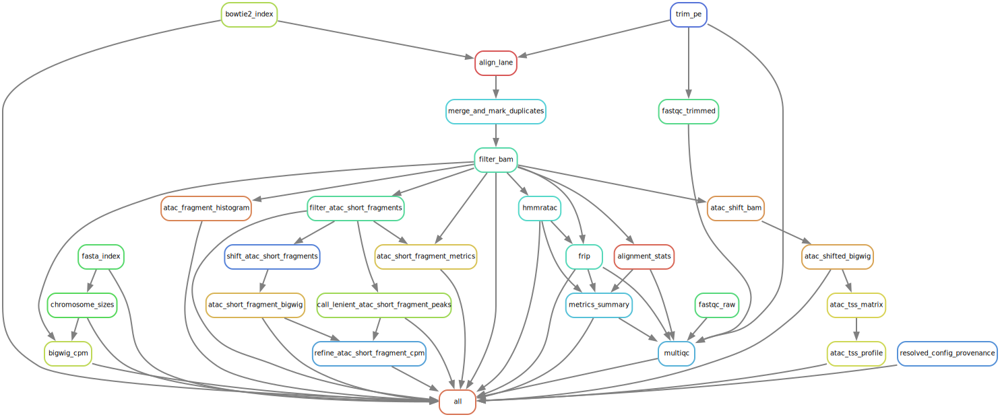

# short-read-processing

Accession-first Snakemake pipeline for bulk ATAC-seq, TF ChIP-seq, and histone
ChIP-seq. A CSV or TSV sample sheet is the only user data input: the pipeline
resolves SRR/SRX/ERR/ERX accessions, downloads FASTQs, prepares `dm6` or `hg38`,
aligns and filters reads, calls peaks, creates signal tracks, and summarizes QC.

Paired-end ATAC defaults to two complementary peak products in one run:

- MACS3 HMMRATAC accessible regions;
- lenient MACS3 candidates from `<150 bp` fragments, followed by CPM-based
  refinement.

For multi-condition paired-end ATAC projects, an optional downstream stage
builds replicate-supported condition peaks and a bounded nonredundant atlas
without merging tissue-specific peaks into long chained intervals.



The figure is the Snakemake rule graph for a representative paired-end ATAC
sample; independent samples and technical lanes expand these same branches in
parallel.

The public entry point is `src/run_pipeline.py`. Acquisition and resolved-config
generation are restart-safe pre-DAG phases; all reference preparation and read
processing steps are in `workflow/Snakefile`.

## Requirements

- Linux or a compatible HPC compute node;
- Mamba or Micromamba;
- enough disk for compressed FASTQs, references, BAMs, and rule environments;
- outbound HTTPS for accession/reference downloads, unless inputs and caches
  have already been staged.

Run commands from the repository root. All environments and workflow caches are
kept inside the repository:

```text
.venv/                 orchestration environment
.micromamba/           optional repo-local Mamba root/cache
.snakemake/conda/      per-rule bioinformatics environments
```

These paths are ignored by Git.

## Install the environment

With Mamba:

```bash
export MAMBA_ROOT_PREFIX="$PWD/.micromamba"
mamba env create --prefix "$PWD/.venv" --file environment.yml
mamba run --prefix "$PWD/.venv" snakemake --version
```

With Micromamba, replace `mamba` with `micromamba`. To update an existing
environment after `environment.yml` changes:

```bash
export MAMBA_ROOT_PREFIX="$PWD/.micromamba"
mamba env update --prefix "$PWD/.venv" --file environment.yml --prune
```

The orchestration environment contains Snakemake, download tools, and test
dependencies. Bowtie2, MACS3, SAMtools, deepTools, FastQC, Cutadapt, MultiQC,
and the R-based ChIP QC tools are isolated by task under `workflow/envs/`.
Snakemake creates those environments automatically below `.snakemake/conda` on
the first run. R packages are not installed into `.venv`.

## Prepare the input sample sheet

The input must be a comma- or tab-separated file following
[`schemas/sample-sheet.schema.yaml`](schemas/sample-sheet.schema.yaml). Do not
list local FASTQ paths. One row represents one public run or experiment
accession; SRX and ERX accessions expand to all associated runs.

Required columns:

| Column | Meaning |
|---|---|
| `accession` | SRR, SRX, ERR, or ERX identifier |
| `sample_id` | Biological library ID; repeat for technical runs of the same library |
| `assay` | `atac`, `chip_tf`, or `chip_histone` |
| `genome` | `dm6` or `hg38` |
| `role` | `treatment` or `control` |
| `control_id` | Matched ChIP control `sample_id`; blank for ATAC, controls, or IP-only ChIP |
| `replicate` | Positive biological-replicate number |
| `peak_caller` | `hmmratac`, `callpeak`, or blank for the assay default |

Minimal paired-end ATAC input:

```text
accession  sample_id       assay  genome  role       control_id  replicate  peak_caller
ERR3975804 e5_atac_rep1    atac   dm6    treatment              1          hmmratac
ERR3975777 e5_atac_rep1    atac   dm6    treatment              1          hmmratac
ERR3975789 e5_atac_rep2    atac   dm6    treatment              2          hmmratac
```

The first two rows are technical runs because they share `sample_id`; they are
trimmed and aligned independently, then merged before duplicate marking. The
third row is a separate biological replicate and remains a separate sample.

ChIP with an explicit input control uses a control row and links the treatment
through `control_id`:

```text
accession  sample_id  assay    genome  role       control_id  replicate  peak_caller
SRR100001  tf_rep1    chip_tf  hg38    treatment  input_rep1  1          callpeak
SRR100002  input_rep1 chip_tf  hg38    control                1
```

IP-only ChIP is supported by leaving `control_id` blank. MACS3 then runs without
`-c`; control-dependent fingerprint QC is omitted.

Optional typed columns control MACS3/HMMRATAC, trimming, alignment, filtering,
and adapters. Important examples include:

```text
macs3_format=BAM
macs3_nomodel=true
macs3_shift=-75
macs3_extsize=150
adapter_preset=custom
adapter_fasta=resources/adapters/nextera.fa
```

Free-form shell arguments are deliberately unsupported. Use the named columns
defined by the schema. Preset defaults are Nextera for ATAC, TruSeq for ChIP,
Bowtie2 `very-sensitive`, MAPQ 30, duplicate removal, and mitochondrial-read
removal.

Validate a sheet without downloading data:

```bash
mamba run --prefix "$PWD/.venv" \
  python src/validate_sample_sheet.py samples.tsv
```

## Run the pipeline locally

This command validates the sheet, downloads FASTQs concurrently, writes the
resolved YAML, prepares the reference, and runs Snakemake:

```bash
mamba run --prefix "$PWD/.venv" \
  python src/run_pipeline.py samples.tsv \
  --project chromatin-study \
  --run-id baseline \
  --output-dir data/raw/chromatin-study \
  --reference-root references \
  --cores 24 \
  --file-jobs 8 \
  --connections 8
```

The main locations are then:

```text
data/raw/chromatin-study/               downloaded FASTQs and manifest
configs/chromatin-study.yaml            fully resolved workflow config
references/<genome>/                    downloaded/prepared reference
results/chromatin-study/baseline/       final outputs and logs
work/chromatin-study/baseline/          restartable intermediates
```

Independent accessions, lanes, and samples run concurrently. `--cores` is the
aggregate local CPU limit; each rule also declares its own threads and memory.
For SRA Toolkit fallbacks, `--sra-jobs` controls simultaneous conversions and
`--threads` is divided among those jobs. For direct ENA transfers,
`--file-jobs` controls simultaneous files and `--connections` controls HTTP
range connections per file.

Useful execution boundaries:

```bash
# Resolve and download only
python src/run_pipeline.py samples.tsv --download-only --output-dir data/raw/project

# Generate YAML from an existing manifest without running Snakemake
python src/run_pipeline.py samples.tsv --skip-download \
  --manifest data/raw/project/download_manifest.tsv --config-only

# Inspect the complete DAG without executing jobs
python src/run_pipeline.py samples.tsv --skip-download \
  --manifest data/raw/project/download_manifest.tsv --snakemake-dry-run
```

Run those commands through `mamba run --prefix "$PWD/.venv"` as above.

### Run the dm6 atlas inputs

The curated atlas sheets are ready to use:

```bash
# ATAC: 23 accessions / 22 biological libraries
mamba run --prefix "$PWD/.venv" \
  python src/run_pipeline.py resources/atlas_atac_selected.sample_sheet.tsv \
  --project atlas-atac-dm6 --run-id baseline \
  --output-dir data/raw/atlas_atac --cores 24 \
  --atac-atlas-condition-map resources/atlas_atac_conditions.tsv

# H3K27ac: 15 IP-only runs
mamba run --prefix "$PWD/.venv" \
  python src/run_pipeline.py resources/atlas_h3k27ac_ip_only.sample_sheet.tsv \
  --project atlas-h3k27ac-dm6 --run-id baseline \
  --output-dir data/raw/atlas_h3k27ac --cores 24
```

The source selection metadata and deterministic sample-sheet generators are
documented in [`resources/README.md`](resources/README.md).

The optional condition map follows
[`schemas/atac-atlas-condition-map.schema.yaml`](schemas/atac-atlas-condition-map.schema.yaml).
It assigns each biological `sample_id` exactly once; technical accessions do
not appear because they have already been merged into that biological library.
Atlas defaults are two supporting biological replicates, at least 50% pooled
peak coverage per supporting replicate, and 250-bp global atlas windows. These
can be changed with `--atac-atlas-minimum-replicates`,
`--atac-atlas-overlap-fraction`, and `--atac-atlas-peak-width`.

### Restart or resume

Re-run the same command with the same `project` and `run-id`:

- aria2 resumes managed ENA partial downloads and verifies reported MD5 sums;
- SRA conversion writes to staging and promotes FASTQs only after completion;
- manifests and resolved YAMLs are atomic and unchanged files are not replaced;
- Snakemake skips complete outputs and reruns incomplete jobs;
- raw FASTQs and completed canonical BAMs are never overwritten by downstream
  rules.

To reuse completed downloads explicitly, add:

```bash
--skip-download --manifest data/raw/project/download_manifest.tsv
```

Use a new `run-id` when changing scientific parameters so previous results are
preserved. The ATAC short-fragment refinement defaults are recorded in the
resolved YAML under `atac_refinement`.

## Reference preparation

Generated `dm6` and `hg38` configurations include checksum-pinned reference
sources. The Snakemake DAG downloads and prepares:

```text
references/<genome>/<genome>.fa
references/<genome>/<genome>.fa.fai
references/<genome>/<genome>.chrom.sizes
references/<genome>/<genome>.blacklist.bed
references/<genome>/<genome>.tss.bed
references/<genome>/<genome>.autosomes.txt
references/<genome>/bowtie2/<genome>.*.bt2
references/<genome>/sources/*
```

A hand-written resolved YAML may omit `reference.preparation` and point to
existing local assets. FASTA indexing, chromosome sizes, and missing Bowtie2
indexes remain workflow targets.

## Outputs

Each run writes below `results/<project>/<run-id>/`:

```text
bam/
  <sample>.final.bam[.bai]             filtered canonical alignments

peaks/<sample>/
  *_accessible_regions.narrowPeak      HMMRATAC ATAC peaks
  *_peaks.narrowPeak                   MACS3 narrow peaks
  *_peaks.broadPeak                    MACS3 broad histone peaks
  *_treat_pileup.bdg                   callpeak treatment signal
  *_control_lambda.bdg                 callpeak local background

tracks/
  <sample>.CPM.bw                      unshifted CPM coverage
  <sample>.Tn5-shifted.CPM.bw          ATAC insertion-oriented coverage

atac_short_fragments/
  bam/*.fragments-lt150.bam[.bai]      proper pairs with 0 < |TLEN| < 150
  tracks/*.Tn5-shifted.CPM.bw          CPM within the retained subset
  macs3/<sample>/*_peaks.narrowPeak    lenient q=0.10 candidates
  macs3/<sample>/*_{treat_pileup,control_lambda}.bdg
  refined/*.CPM-refined.bed            50-400 bp signal-refined peaks
  refined/*.Excluded.bed               lowest-cutoff unselected signal intervals
  refined/*.stats.json                 refinement status, counts, and thresholds
  qc/*.fragment-filter.tsv             retained-fragment statistics

atac_atlas/
  conditions/<condition>/bam/          restartable pooled short-fragment BAM and index
  conditions/<condition>/              pooled candidates, CPM track, and refinement
  conditions/<condition>/*.consensus.bed
                                       replicate-supported condition peaks
  conditions/<condition>/*.support.tsv per-replicate pooled-peak coverage
  atlas.peaks.bed                      bounded non-overlapping global atlas
  atlas.variable.peaks.bed             condition-balanced variable boundaries
  atlas.membership.tsv                 source peak-to-atlas assignments
  atlas.presence.tsv                   condition presence matrix
  atlas.coverage_fraction.tsv          condition peak coverage matrix
  atlas.mean_cpm.tsv                   mean condition CPM matrix
  atlas.maximum_cpm.tsv                maximum condition CPM matrix
  atlas.stats.json                     method, parameters, and counts
  atlas.narrow-first.anchors250.bed     narrow-source-first fixed anchors
  atlas.narrow-first.variable.peaks.bed condition-balanced boundaries for those anchors
  atlas.narrow-first.*.tsv/json         membership, matrices, and provenance
  atlas.dhs-support-fraction.bw         fraction of conditions with a DHS at each base
  atlas.fwhm-boundaries.bed             anchor-centered DHS-support half-maximum widths
  atlas.fwhm-diagnostics.tsv            support and neighbor-contact diagnostics
  atlas.fwhm.stats.json                 FWHM method and summary counts
  atlas.center-mode-half-prominence-boundaries.bed
                                       center-associated local support modes
  atlas.center-mode-half-prominence-*.tsv/json
                                       local-mode prominence diagnostics and summary
  atlas.dhs-driven.anchors250.bed       post-grouping measurement anchors
  atlas.dhs-driven.peaks.bed            direct DHS-seed consensus boundaries
  atlas.dhs-driven.*.tsv/json           DHS-driven membership, matrices, and provenance
  atlas.dhs-driven.signal-shaped.peaks.bed
                                       contributor-aware signal boundaries
  atlas.dhs-driven.aggregate-shape.bw   normalized aggregate shape signal
  atlas.dhs-driven.signal-shape.tsv     per-element boundary diagnostics
  atlas.dhs-driven.signal-shape.stats.json
                                       shape parameters and summary counts

qc/
  fastqc/raw/ and fastqc/trimmed/       per-FASTQ FastQC reports
  cutadapt/                             trimming JSON
  alignment/                            flagstat, stats, and idxstats
  frip/                                 numerator, denominator, and FRiP
  tss/ and fragments/                   ATAC TSS and fragment-size QC
  chip/                                 ChIP fingerprint/cross-correlation
  metrics.tsv and metrics.json          stable machine-readable summary
  multiqc/multiqc_report.html           aggregate report

provenance/resolved_config.json         resolved run configuration
logs/                                   commands and tool logs by stage
```

MACS3 `callpeak` uses `-B --SPMR`, so both treatment and control-lambda
bedGraphs are declared outputs. Paired-end ATAC defaults to HMMRATAC for its
primary peaks. The additional short-fragment branch uses MACS3 `-f BAM
--nomodel --shift -75 --extsize 150 -q 0.10 --keep-dup all`, followed by a mean
CPM floor of 2 and 50-400 bp geometry. CPM-refined scores are signal-derived;
they are not q-values or an independent FDR estimate.
Observed positive CPM cutoffs are evaluated from high to low. Qualifying
high-signal modes expand as the cutoff falls; when a lower-signal bridge would
merge established modes, the lower mode must have at least 25% prominence
relative to the saddle: `(lower summit - saddle) / lower summit >= 0.25`.
Shallower subdivisions are merged and continue expanding as one component;
prominent modes retain their last separate boundaries. This can split a broad
MACS3 candidate without treating small reproducible fluctuations as separate
peaks or forcing every mode to the 50-bp minimum. The prominence threshold,
algorithm identifier, and threshold rule are recorded in each refinement stats
JSON.
If a sample has no MACS3 candidates or no contained positive signal, refinement
writes valid empty BED files and records the reason in the stats `status` field.

### ATAC consensus and global atlas method

The atlas branch is optional and valid only for paired-end ATAC. For each
condition, it merges the already filtered `<150 bp` biological-replicate BAMs,
recomputes the pooled Tn5-shifted CPM track, calls lenient MACS3 candidates, and
applies the same CPM refinement. A pooled refined peak is retained when at
least the configured number of biological replicates cover the configured
fraction of its bases. The default is two replicates covering at least 50%.

Across conditions, peaks are centered on their maximum pooled CPM bin and
converted to fixed-width windows. Candidates are ranked by maximum-CPM
percentile within each condition. The highest-ranked window is retained, all
windows directly overlapping it are assigned to it and removed, and selection
continues iteratively. Boundaries are never unioned, preventing overlap chains
from creating large peaks. Tissue specificity is preserved in the membership,
presence, coverage-fraction, and CPM matrices; a peak does not need to occur in
multiple tissues. This is implemented in Python and uses the existing
`atac_qc` environment—no ArchR or additional R packages are installed.

`atlas.variable.peaks.bed` preserves the same atlas IDs but estimates biological
boundaries from the assigned condition peaks. Each condition contributes at
most one vote (its strongest assigned peak); the output uses the unweighted
median start and end. A peak seen in one condition keeps that condition's
boundaries. Direct overlaps between neighboring variable intervals are split
midway only when both intervals remain at least 50 bp; otherwise both variable
records are retained as overlapping evidence, without interval union or
chaining. The fixed non-overlapping anchors remain the coordinate system for
the quantitative matrices.

The narrow-source-first comparison keeps the same 250-bp non-overlap rule but
changes seed ordering. Original refined DHS width is considered before signal
priority, so a broad DHS whose fixed window bridges two non-overlapping narrow
DHS windows cannot eliminate both smaller modes. After anchors are selected,
every source DHS is annotated to every retained 250-bp anchor its candidate
window overlaps. A broad unresolved DHS can therefore support both smaller
atlas elements. This is emitted under `atlas.narrow-first.*` and does not
replace the canonical signal-prioritized fixed atlas.

The DHS-support boundary model uses all replicate-supported condition DHSs,
independently of ATAC coverage amplitude. Overlapping DHSs are first unioned
within each condition, so a condition contributes at most one vote per base.
`atlas.dhs-support-fraction.bw` is the resulting number of supporting
conditions divided by the total number of conditions. For each fixed 250-bp
anchor, the method selects the maximum support inside the anchor nearest its
center, calculates `ceil(maximum / 2)`, and reports the connected support
component containing that maximum as `atlas.fwhm-boundaries.bed`. Consequently,
a tissue-specific element is not diluted by absent tissues: support one has a
half-maximum requirement of one. No width cap, interval merge, or forced
neighbor split is applied. Components that reach another anchor or bridge to a
higher-support peak are retained and explicitly flagged in the diagnostics.
Because the input is a discrete condition-support track, this is a
half-maximum support width rather than classical FWHM of a smooth signal.

The center-mode alternative addresses adjacent support peaks without changing
the support track or fixed anchors. It identifies local DHS-support maxima
inside each anchor, selects the mode nearest the anchor center even when it is
lower than another mode, and measures that mode at half prominence. Prominence
uses the higher of the left and right valley bases encountered before a taller
peak or a zero-support gap. This raises the contour above an intervening valley
and prevents the selected smaller mode from inheriting a connected taller
neighbor. It is emitted separately for direct comparison with ordinary FWHM.

The parallel DHS-driven atlas starts from the same tissue consensus DHSs but
does not use fixed windows to establish membership. The strongest remaining DHS
is a seed; another DHS joins it only when the original intervals overlap and
the summit of either DHS lies inside the other interval. Members never recruit
additional members, so an overlap chain cannot bridge two seeds. Median
condition boundaries define `atlas.dhs-driven.peaks.bed`; 250-bp measurement
anchors are created only afterward. Separate membership, CPM, coverage, and
presence outputs allow direct comparison with the fixed-window grouping.

The final signal-shaping step keeps this DHS-driven membership unchanged. For
each atlas element, it selects the strongest assigned DHS per contributing
condition and extracts that condition's pooled short-fragment CPM profile in a
1-kb window. Profiles are binned at 10 bp, smoothed over 30 bp, divided by
their maximum inside the assigned source DHS (and capped at 1), and combined
with an equal-weight median. The selected aggregate summit must also overlap a
contributing source DHS, preventing a stronger neighboring element from
capturing the boundary. Thus a
tissue-specific element uses its one observed tissue and is not diluted by
zero signal from other tissues; no tissue gains extra weight from sequencing
depth or additional source peaks. The boundary is the component containing the
aggregate maximum above both 20% of that maximum and a robust local-background
threshold (median + 3 scaled MAD), constrained to 50-400 bp. Strong secondary
modes are reported in `atlas.dhs-driven.signal-shape.tsv` but are not bridged
into the primary element.

`atlas.dhs-driven.aggregate-shape.bw` records the locally normalized aggregate
used for boundary selection (range 0-1 within shaped elements). It is a shape
comparison track, not CPM and not a pooled read-depth measurement. Absolute
per-condition CPM remains in the condition BigWigs and atlas CPM matrices.

### Build an IGV session

Create a portable session containing each ATAC short-fragment CPM track, its
lenient narrowPeak candidates, its refined peaks, and optional matching
H3K27ac CPM tracks:

```bash
mamba run --prefix "$PWD/.venv" \
  python src/build_igv_session.py \
  results/atlas-atac-dm6/baseline/atac_short_fragments \
  --h3k27ac-tracks results/atlas-h3k27ac-dm6/baseline/tracks \
  --output results/atlas-atac-dm6/baseline/atlas.igv.xml \
  --genome dm6
```

Add narrow-source-first anchors and boundaries, the condition DHS-support
track, ordinary FWHM, center-mode half-prominence boundaries, DHS-driven
anchors, median DHS boundaries, contributor-normalized aggregate signal, and
signal-shaped boundaries with:

```bash
mamba run --prefix "$PWD/.venv" \
  python src/build_igv_session.py \
  results/atlas-atac-dm6/hmmratac/atac_atlas \
  --condition-atlas --include-dhs-driven \
  --output results/atlas-atac-dm6/hmmratac/atac_atlas/atlas-dhs-driven-comparison.igv.xml \
  --genome dm6
```

The XML uses paths relative to the session file, so move the session and its
track files together.

For the pooled condition atlas, create a session containing each condition's
ATAC CPM signal and replicate-supported consensus peaks, followed by the fixed
and variable global atlas tracks:

```bash
mamba run --prefix "$PWD/.venv" \
  python src/build_igv_session.py \
  results/atlas-atac-dm6/hmmratac/atac_atlas \
  --condition-atlas \
  --output results/atlas-atac-dm6/hmmratac/atac_atlas/atlas-condition-consensus.igv.xml \
  --genome dm6
```

## Run on SLURM

Workflow rules are executor-independent and expose `threads` and `mem_mb`.
Keep site-specific SBATCH launchers, accounts, partitions, paths, and Snakemake
SLURM profiles under the ignored `slurm/` directory. Never run downloads,
alignment, or peak calling on a cluster login node.

A local shared-filesystem profile can be passed with:

```bash
mamba run --prefix "$PWD/.venv" \
  python src/run_pipeline.py samples.tsv \
  --workflow-profile slurm/profile \
  --jobs 50 --cores 200 --max-threads 16
```

Here, `--jobs` caps submitted/running jobs, `--cores` caps their aggregate CPU
requests, and `--max-threads` caps any one rule. Cluster-specific values belong
in the ignored profile rather than the portable workflow.

## Standalone acquisition and configuration

The one-command entry point is preferred, but phases can be run separately:

```bash
# One accession or experiment
python src/download_accession.py SRX017289 --output-dir data/raw

# Every accession in a canonical sheet
python src/download_batch.py samples.tsv --output-dir data/raw

# Resolve YAML from a completed manifest
python src/write_pipeline_configs.py samples.tsv \
  --manifest data/raw/download_manifest.tsv \
  --project chromatin-study --run-id baseline
```

Use the repository environment for each command.

## Tests and workflow validation

```bash
export MAMBA_ROOT_PREFIX="$PWD/.micromamba"

mamba run --prefix "$PWD/.venv" pytest -q

mamba run --prefix "$PWD/.venv" \
  snakemake --snakefile workflow/Snakefile \
  --configfile tests/fixtures/workflow_config.yaml --lint

mamba run --prefix "$PWD/.venv" \
  snakemake --snakefile workflow/Snakefile \
  --configfile tests/fixtures/workflow_config.yaml --cores 8 --dry-run
```

Regenerate the embedded representative ATAC rule graph after changing workflow
dependencies:

```bash
XDG_CACHE_HOME="$PWD/.cache" \
  .venv/bin/snakemake --snakefile workflow/Snakefile \
  --configfile docs/workflow-dag.config.yaml --rulegraph \
  | .venv/bin/dot -Tsvg -o docs/workflow-dag.svg
```

See [`PLAN.md`](PLAN.md) for design decisions and [`AGENTS.md`](AGENTS.md) for
repository-specific contribution rules.
